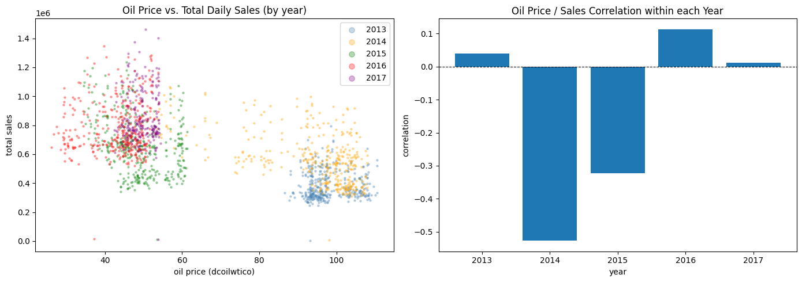
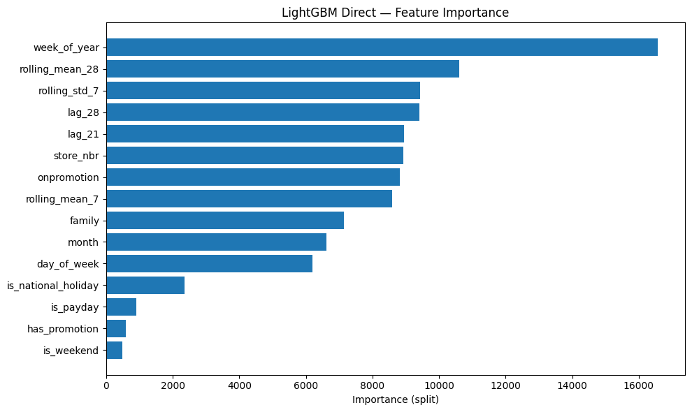

# Retail Demand Forecasting: Foundation Model vs. Classical ML

## Completed March 2026

Retail demand forecasting directly impacts inventory cost: an out-of-stock shelf
loses the sale and erodes customer trust, while moderate overstock ties up
working capital but can still be sold. This asymmetry makes accurate forecasting
one of the highest-leverage problems in retail operations.

This project benchmarks three forecasting approaches on the Kaggle Store Sales
dataset (Favorita, Ecuador, 54 stores, 33 product families, 4.5 years of daily
sales): a zero-shot foundation model (Chronos-small), the same foundation model
with covariate support (Chronos-2), and a classical ML pipeline with engineered
features (LightGBM). 

**The central question: can a pretrained foundation model
match a carefully engineered classical pipeline when both have access to the
same external information, such as promotions, holidays, and paydays?**


**Notebook:** [Kaggle retail-demand-forecasting](https://www.kaggle.com/code/dantronic/retail-demand-forecasting)

---

## Key Results

| Metric | Naive Baseline | Chronos-small | Chronos-2 | LightGBM Direct |
|---|---|---|---|---|
| RMSLE (primary) | 0.3806 | 0.3048 | **0.2581** | 0.2588 |
| RMSE | 597.47 | 528.91 | 464.93 | **288.77** |
| MAE | 233.60 | 196.76 | 162.89 | **124.67** |
| Inference time | n/a | 56s (GPU) | 14.8s (GPU) | ~1s (CPU) |
| Model size | n/a | ~90 MB | 478 MB | 11.2 MB |

Chronos-2 with covariates edges out LightGBM on RMSLE (0.2581 vs. 0.2588).
LightGBM wins on absolute error metrics by a wide margin, runs on CPU,
is 43x smaller, and has sub-second inference.

The takeaway is not that one model is universally better. It depends on what
the business optimizes for. If symmetric log-scale accuracy matters most
(e.g. forecasting across products with very different sales volumes), Chronos-2
is competitive. If absolute error, latency, and deployment cost matter,
LightGBM is the clear choice.

---

## Dataset and Subset Selection

The [Kaggle Store Sales](https://www.kaggle.com/competitions/store-sales-time-series-forecasting)
dataset contains daily sales for 54 stores and 33 product families across
4.5 years (2013-01-01 to 2017-08-15) in Ecuador.

EDA revealed that not all families and stores are equally useful for benchmarking.
Two subset decisions were made based on quantitative analysis, documented in
[ADR-002](docs/ADR.md):

**Family filter (33 to 19 families).** Zero-rate analysis showed a natural break
at ~35%. Families like BOOKS (97% zero-sales days) and BABY CARE (94%) are
niche products where neither model has meaningful signal. The 19 retained families
are FMCG and food categories with stable, regular sales patterns.

**Store filter (54 to 14 stores).** The top 14 stores by volume cover ~50% of
total sales. Store-level family mix variance is low (max std: 0.055), confirming
that subsetting does not lose structural diversity.

---

## EDA Highlights

### Promotion Impact

Promotion lift ranges from 24% (PREPARED FOODS) to 208% (PRODUCE) across all
19 benchmark families. This is the strongest external signal in the dataset
and the central hypothesis of the benchmark: `onpromotion` is structurally
invisible to Chronos-small (univariate, zero-shot), partially visible to
Chronos-2 (via covariates), and directly engineered as a feature for LightGBM.

### Oil Price: A Confounder, Not a Feature

Oil price shows a raw correlation of -0.528 with daily sales. Year-stratified
analysis revealed this as a time-trend confounder rather than a causal
relationship. The two visible clusters correspond to pre- and post-2014 oil
price collapse periods, not a demand mechanism. Within individual years,
correlations drop to near zero. The feature is excluded to prevent time-trend
leakage ([ADR-002](docs/ADR.md)).



### Target Distribution

Sales is strongly right-skewed with a bimodal log1p distribution: a spike at
zero (closed stores or no-sale days) and a broad peak around log1p 5-6
(regular sales activity). This confirms RMSLE as the appropriate primary
metric and motivates the Tweedie objective for LightGBM.

---

## Methodology

### Forecast Approach

Both Direct and Recursive LightGBM variants were trained and compared
empirically on the same 15-day validation set (2017-08-01 to 2017-08-15).

Direct multi-step forecast predicts all days at once. The minimum leakage-free
lag is 21 days (3 x 7), preserving the day-of-week effect.

Recursive single-step forecast predicts one day ahead, feeding predictions back
as lag inputs. This unlocks lag_7 (the strongest individual signal) but
introduces error accumulation.

Result: Direct won on all three metrics. Error accumulation in the recursive
loop outweighed the benefit of lag_7 over 15 forecast steps
([ADR-003](docs/ADR.md)).

### Feature Engineering

All features are implemented as standalone, testable functions with explicit
signatures. The pipeline reads like a sentence:

```python
df = create_lag_features(df, lag_days=LAG_DAYS)
df = create_rolling_features(df, window_days=WINDOW_DAYS)
df = create_calendar_features(df)
df = create_promotion_features(df)
```

Each function is portable into `src/retail_forecast/features.py` without
modification. Training and inference share the same transformation code.

| Feature Group | Features | Predictive Power |
|---|---|---|
| Lag | lag_21, lag_28 | High. Wochentag-aligned, leakage-free for 16-day horizon |
| Rolling | rolling_mean_7, rolling_mean_28, rolling_std_7 | High/Medium. Based on shift(16) |
| Calendar | day_of_week, month, week_of_year, is_weekend, is_payday | High/Medium. Weekly pattern dominant |
| Promotion | onpromotion, has_promotion | High. 24-208% lift across all families |
| Holiday | is_national_holiday | High. Structural retail signal |
| Categorical | store_nbr, family | Very High. LightGBM native encoding |

### Leakage Prevention

Lag features use a minimum shift of 21 days (Direct) to guarantee that no
future data leaks into the forecast horizon. Rolling features are based on
`shift(16)` (the forecast horizon), not on the raw target. The validation set
is strictly after the split date by construction, not by convention.

### Feature Importance

8 of the top 10 most important features are engineered features that were not
part of the raw dataset. This validates the feature engineering effort and
explains why Chronos-small (with no access to these features) underperforms.



---

## Model Comparison

### Chronos-small (Zero-Shot, No Features)

The original Chronos model sees only historical sales values. No external
information. RMSLE of 0.3048 represents a 20% improvement over the naive
baseline, demonstrating that the pretrained model captures weekly seasonality
from the time series alone.

### Chronos-2 (Zero-Shot, With Covariates)

Chronos-2 (released October 2025) natively supports covariates. The same
features available to LightGBM (onpromotion, is_national_holiday, is_payday)
are passed as future-known covariates. RMSLE drops to 0.2581, beating
LightGBM on this metric.

However, RMSE (464.93 vs. 288.77) and MAE (162.89 vs. 124.67) remain
substantially worse. Chronos-2 handles proportional errors well (hence the
strong RMSLE), but makes larger absolute errors on high-volume products.

### LightGBM Direct (Engineered Features)

An untuned LightGBM with Tweedie objective. No hyperparameter optimization.
The model relies on 15 features including lag, rolling, calendar, promotion,
holiday, and categorical signals. RMSLE of 0.2588, RMSE of 288.77, MAE of
124.67.

The Tweedie objective (variance_power=1.1, closer to Poisson) is chosen for
the zero-inflated, right-skewed sales distribution.

### Interpretation

The results tell a nuanced story rather than a simple winner/loser narrative.

**Covariates close the RMSLE gap.** Chronos-small without features scored
0.3048. Chronos-2 with the same covariates as LightGBM scored 0.2581. Giving
the foundation model access to external information (promotions, holidays,
paydays) closes the gap entirely on RMSLE.

**Absolute error metrics remain dominated by LightGBM.** RMSE and MAE are
where LightGBM's engineered lag and rolling features shine. These features
capture recent sales dynamics that Chronos-2 does not model with the same
precision, even with covariates.

**Operational trade-offs favor LightGBM for most retail use cases.** 43x
smaller model, CPU inference in under a second, no GPU dependency. For a
retailer running thousands of daily forecasts across stores and products,
these operational characteristics matter as much as accuracy.

---

## Key Decisions

Four Architecture Decision Records document the reasoning behind the major
choices. Full ADRs in [`docs/ADR.md`](docs/ADR.md).

**ADR-001: Evaluation Design.** RMSLE as primary metric (Kaggle standard,
robust for right-skewed sales). Median of Chronos quantile samples as point
forecast (robust to outlier quantiles). Kaggle Leaderboard as external anchor.

**ADR-002: Dataset Subset Selection.** 19 families (zero-rate < 30%), top 14
stores (~50% volume). Oil price excluded after year-stratified confounder
analysis.

**ADR-003: Direct vs. Recursive Forecasting.** Both approaches trained and
evaluated empirically. Direct won on all three metrics (RMSLE 0.2588 vs.
0.2594). Documented with validation scores, not theoretical arguments.

**ADR-004: Chronos-2 Covariate Integration.** All three covariates
(onpromotion, is_national_holiday, is_payday) classified as future-known.
Date gap filling required for Chronos-2 (gapless time series constraint).

---

## Engineering Standards

The notebook follows coding standards derived from the Google Python Style
Guide, Google's Rules of ML, and Richards & Ford "Fundamentals of Software
Architecture."

**Hyperparameters in config dicts.** `LGBM_CONFIG` is a single dict unpacked
with `**`. No magic numbers in training calls. Every non-default parameter
carries an inline comment.

**Feature schema assertions.** After every `train_lgbm` call, the fitted
model's feature names are asserted against the expected constant
(`FEATURES_DIRECT` / `FEATURES_RECURSIVE`). Silent mismatches between config
and model are caught immediately.

**Shared transformation code.** Feature functions are called identically at
training and inference time. No reimplementation for serving.

**Temporal integrity by construction.** The validation set is strictly after
`SPLIT_DATE`. The forecast approach decision (Direct vs. Recursive) is based
on empirical validation scores, not theoretical preference.

**Categorical lifecycle management.** LightGBM requires identical category
levels across train and validation sets. The lifecycle is managed in three
explicit steps: cast on full DataFrame before split, re-align validation
levels after split, restore levels during batch inference.

---

## Project Layout

```
retail-demand-forecasting/
  notebooks/
    retail-demand-forecasting.ipynb    Full benchmark notebook (runs on Kaggle GPU)
  docs/
    ADR.md                             ADR-001 through ADR-004
    images/                            EDA and result visualizations
  pyproject.toml
  .gitignore
  README.md
```

---

## Reproduction

The notebook runs on Kaggle with a T4 GPU. The dataset is loaded directly
via `kagglehub.competition_download("store-sales-time-series-forecasting")`.

1. Fork the Kaggle notebook or clone the repo
2. Enable GPU accelerator (T4) in Kaggle settings
3. Accept the Store Sales competition rules on Kaggle
4. Run all cells sequentially

LightGBM training takes ~32 seconds. Chronos-small inference takes ~56 seconds.
Chronos-2 inference takes ~15 seconds. Total notebook runtime is under 5 minutes.
